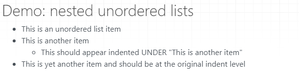

# mkdocs simple demo

This exists to demonstrate aspects of mkdocs, such as bugs, in a way where the whole process is easy to understand and reproduce.

## April 2025: Issues with (unsupported) Mermaid architecture

Replicating the issue here to have a simpler environment.

Setting up mermaid with custom icons per [https://github.com/squidfunk/mkdocs-material/discussions/7723#discussioncomment-12432104](https://github.com/squidfunk/mkdocs-material/discussions/7723#discussioncomment-12432104)

`mkdocs.yaml`:

```yaml
extra_javascript:
  - path: assets/javascript/extra.js
markdown_extensions:
  - pymdownx.superfences:
      custom_fences:
        - name: mermaid
          class: mermaid
          format: !!python/name:pymdownx.superfences.fence_code_format
```

Created `extra.js` with the content from the above link.

Test mermaid icons:

```mermaid
architecture-beta
    group api(logos:aws-lambda)[API]

    service db(logos:aws-aurora)[Database] in api
    service disk1(logos:aws-glacier)[Storage] in api
    service disk2(logos:aws-s3)[Storage] in api
    service server(logos:aws-ec2)[Server] in api

    db:L -- R:server
    disk1:T -- B:server
    disk2:T -- B:db
```



Shoot... it works great here in the simple environment but not in my messy "real" document collection.

Maybe the answer is to make my real document collection simpler or create a new doc collection for architecture diagrams.

## April 2025: Updated to use GitHub actions

Continuing the long history of CI changes in GitHub originating with TravisCI. Hopefully GitHub actions stick around for a while.

## Demo: nested unordered lists

* This is an unordered list item
* This is another item
  * This should appear indented UNDER "This is another item"
* This is yet another item and should be at the original indent level

### GitHub rendering

Shows the third bullet indented:


### mkdocs rendering

(Using GitHub version as of June 29 2019)

Shows all unordered list items at the same indent level.


HTML as created:

```html
<h1 id="mkdocs-simple-demo">mkdocs simple demo</h1>
<p>This exists to demonstrate aspects of mkdocs, such as bugs, in a way where the whole process is easy to understand and reproduce.</p>
<h2 id="demo-nested-unordered-lists">Demo: nested unordered lists</h2>
<ul>
<li>This is an unordered list item</li>
<li>This is another item</li>
<li>This should appear indented UNDER "This is another item"</li>
<li>This is yet another item and should be at the original indent level</li>
</ul>
```

### Solution: upstream fix or use custom extension

Lots of good discussion and detail was found in [mkdocs issue 545](https://github.com/mkdocs/mkdocs/issues/545)

#### FIXED via `mdx_truly_sane_lists`

This was added to `mkdocs.yml`:

```YAML
markdown_extensions:
- mdx_truly_sane_lists
```

And an appropriate `pip` command was added to the Travis CI "install" section to load the extension.

That results in this GitHub-compatible behavior:



## Demo: nested unordered lists with Markdown-spec spacing (4 spaces)

* This is an unordered list item
* This is another item
    * This should appear indented UNDER "This is another item"
* This is yet another item and should be at the original indent level

## Test .NET directory

* [dotNet](./dotNet/index.md)

The .NET directory itself gets excluded due to the defaults for `exclude_docs`: [exclude_docs in 1.6.0 docs](https://github.com/mkdocs/mkdocs/blob/1.6.0/docs/user-guide/configuration.md#exclude_docs)

This was new in 1.5 so I'm not clear how .NET gets skipped in 1.4.1, which is the version I was using when I noticed the problem.

* [.NET](./dotNet/index.md)

Using `[.NET](./dotNet/index.md)` generates this warning:

```text
WARNING -  Doc file 'index.md' contains a link './dotNET/index.md', but the target 'dotNET/index.md' is not found among
           documentation files.
DEBUG   -  Reading: doc file with horrible characters +=%#'~^.md
DEBUG   -  Reading: doc file with spaces.md
DEBUG   -  Reading: dotNet/index.md
```

## Test .NET directory under a different name

Copied the contents of the dotNet directory to a new directory by another name:

* [.NET](./notTheName/index.md)

* [Not .NET](./notDotNet/index.md)

Maybe it's something odd that's Windows-specific since I'm doing all my rendering on Windows currently.
