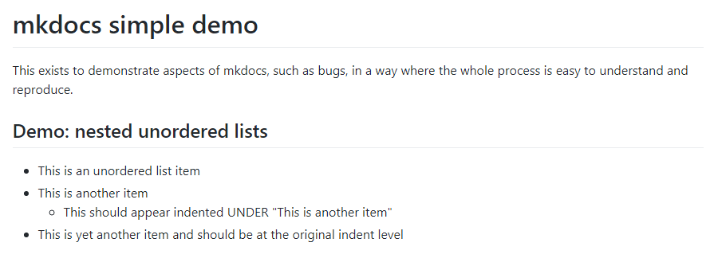
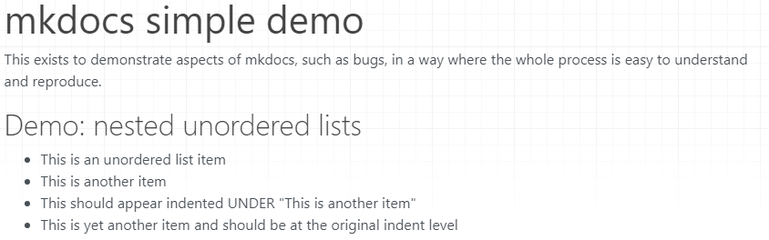

# mkdocs simple demo

This exists to demonstrate aspects of mkdocs, such as bugs, in a way where the whole process is easy to understand and reproduce.

## Demo: nested unordered lists

* This is an unordered list item
* This is another item
  * This should appear indented UNDER "This is another item"
* This is yet another item and should be at the original indent level

### GitHub rendering

Shows the third bullet indented:



### mkdocs rendering

(Using GitHub version as of June 29 2019)

Shows all unordered list items at the same indent level.



HTML as created:

```html
<h1 id="mkdocs-simple-demo">mkdocs simple demo</h1>
<p>This exists to demonstrate aspects of mkdocs, such as bugs, in a way where the whole process is easy to understand and reproduce.</p>
<h2 id="demo-nested-unordered-lists">Demo: nested unordered lists</h2>
<ul>
<li>This is an unordered list item</li>
<li>This is another item</li>
<li>This should appear indented UNDER "This is another item"</li>
<li>This is yet another item and should be at the original indent level</li>
</ul>
```

### Solution: upstream fix or use custom extension

Lots of good discussion and detail was found in [mkdocs issue 545](https://github.com/mkdocs/mkdocs/issues/545)

(Not implemented here yet.)